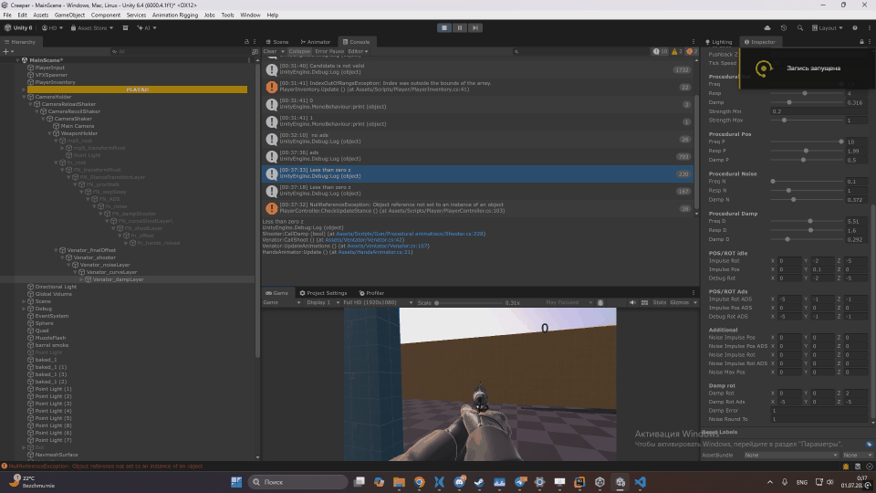
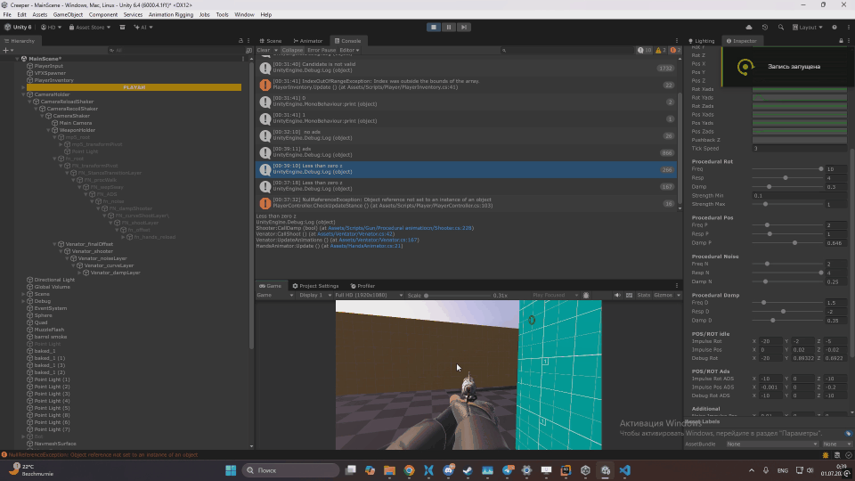
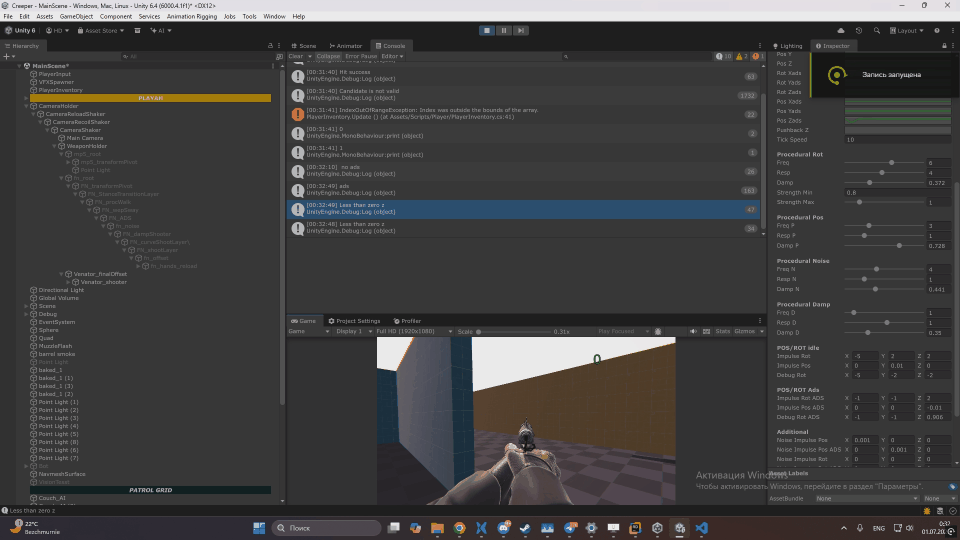
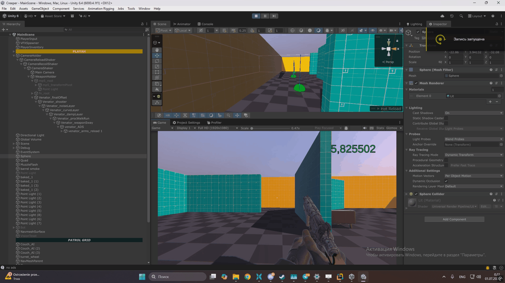
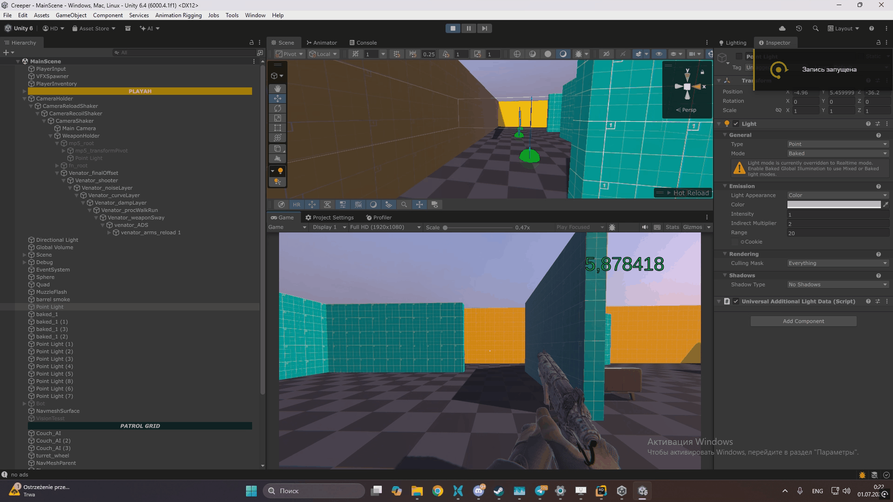
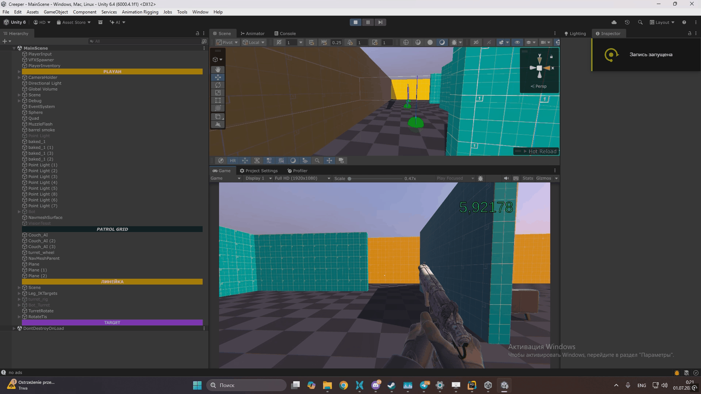

# Procedural Animation Demo

This project demonstrates the implementation of procedural weapon animation, including recoil, weapon sway, and walking/running motion.

Weapon recoil is generated by applying an instantaneous impulse to a second-order system, producing smooth and physically responsive motion.
### Recoil preset 1

### Recoil preset 2

### Recoil preset 3

All animation layers are configurable through dedicated ScriptableObjects. Parameters such as return speed, stiffness, transition speed, amplitudes, and frequencies can be adjusted independently without modifying the code.

Walking and running animations are generated procedurally using sine functions with configurable amplitudes and frequencies, creating natural weapon movement during locomotion.

### Run preset 1

### Run preset 2

### Run preset 3

Weapon sway is driven by the player's mouse input, applying different weights to each axis to achieve a responsive and believable effect.

